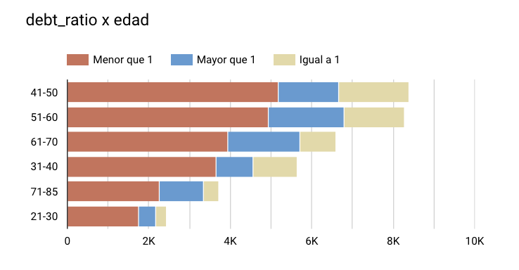
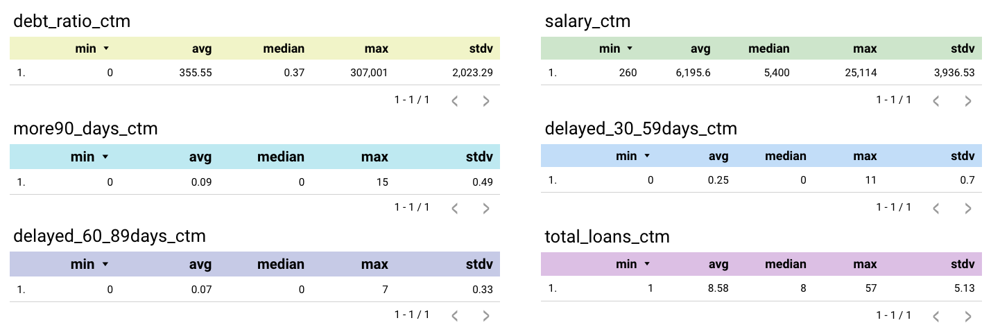
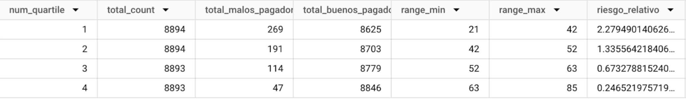
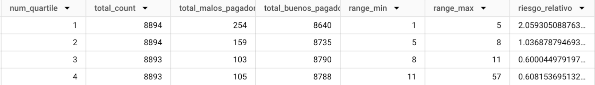
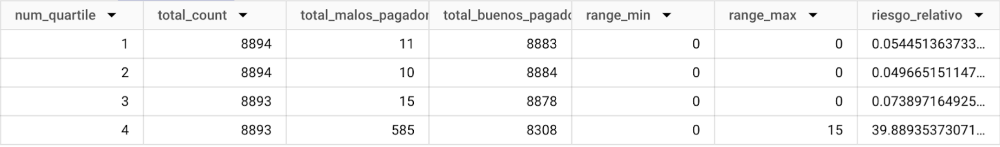

# Proyecto: Riesgo_Relativo

## Indice:
1. [Objetivo](#Objetivo)
2. [Contexto](#Contexto)
3. [Metodología](#Metodología)   
    3.1. [Procesamiento y preparación de datos](#Procesamiento-y-preparación-de-datos)   
    3.2. [Análisis exploratorio](#Análisis-exploratorio)   
    3.3. [Análisis Riesgo Relativo](#Análisis-Riesgo-Relativo)    
    3.4. [Creación de Dashboard en Looker Studio](#Creación-de-Dashboard-en-Looker-Studio)    
4. [Resultados y Recomendaciones](#Resultados-y-Recomendaciones)    
   
## 1. Objetivo:
 Identificar y segmentar a los clientes en función de su riesgo relativo, a través de la evaluación detallada de variables clave en la base de datos proporcionada por el banco. Este análisis inicial establecerá una base sólida para futuros desarrollos, como la creación de un score crediticio y la automatización del proceso de evaluación de riesgo, contribuyendo a la solidez financiera y operativa del banco.

## 2. Contexto: 
El banco "Super Caja" ha experimentado un notable aumento en la demanda de crédito, impulsado por clientes que buscan financiar compras importantes o consolidar deudas existentes. Este crecimiento representa una oportunidad significativa para expandir la cartera crediticia del banco, pero también conlleva un aumento en los riesgos crediticios.

Para gestionar estos riesgos de manera efectiva, el banco cuenta con una base de datos de 36,000 clientes, que incluye información detallada sobre diversas variables clave, como la edad, el salario, los tipos y cantidades de préstamos. Además, la base de datos contiene una clasificación preexistente denominada "default flag", que indica si un cliente es un buen pagador o si presenta riesgos de incumplimiento.

Esta información es crucial para realizar un análisis riguroso del riesgo relativo, lo que permitirá al banco segmentar a sus clientes de manera más precisa y tomar decisiones informadas sobre la concesión de crédito, minimizando así la exposición a pérdidas financieras.

Además, las respuestas obtenidas nos ayudarán a realizar la validación de las siguientes hipótesis:

- **Hi1: Los clientes más jóvenes tienen un mayor riesgo de impago.**

- **Hi2: Las personas con más cantidad de préstamos activos tienen mayor riesgo de ser malos pagadores.**

- **Hi3: Las personas que han retrasado sus pagos por más de 90 días tienen mayor riesgo de ser malos pagadores.**

## 3. Metodología

### 3.1. Procesamiento y preparación de datos:

#### 1. Herramientas:
* Google Sheets
* BigQuery
* Looker Studio
* ChatGPT 
* Canva
* Google Slides 
* Loom

#### 2. Lenguajes:
* SQL en BigQuery

#### 3. Descripción de las fuentes de datos: 
Este conjunto de tablas contiene informción sobre préstamos concedidos a un grupo de clientes del banco,los cuales se dividen en:

**User_ info**: datos del usuario/cliente.
- *user_ id*: Número de identificación del cliente (único para cada cliente).
- *age* : Edad del cliente.
- *sex* :	Sexo del cliente.
- *last_ month_ salary*: Último salario mensual que el cliente reportó al banco.
- *number_dependents*: Número de dependientes.

**loans_ outstanding**: datos del tipo de préstamo.
- *loan_ id*: Número de identificación del préstamo (único para cada préstamo).
- *user_ id* : Número de identificación del cliente.
- *loan_ type*: Tipo de préstamo (real estate = inmobiliario, others = otro).

**loans_ detail**:  el comportamiento de pago de estos préstamos, 
- *user_ id*: Número de identificación del cliente.
- *using_ lines_ not_ secured_ personal_ assets* : Cuánto está utilizando el cliente en relación con su límite de crédito, en líneas que no están garantizadas con bienes personales, como inmuebles y automóviles.
- *debt_ ratio*: Relación entre las deudas y el patrimonio del prestatario; ofrece una idea de cuán endeudada está una persona o empresa en comparación con sus activos.
- *number_ times_ delayed_ payment_ loan_ 30_ 59_ days*: Número de veces que el cliente se retrasó en el pago de un préstamo (entre 30 y 59 días).
- *number_ times_ delayed_ payment_ loan_ 60_ 89_ days*: Número de veces que el cliente retrasó el pago de un préstamo (entre 60 y 89 días).
- *more_ 90_ days_ overdue*: Número de veces que el cliente estuvo más de 90 días vencido.

**default**: la identificación de clientes ya identificados como morosos.
- *user_ id*: Número de identificación del cliente
- *default_ flag* : Clasificación de los clientes morosos (1 para clientes que pagan mal, 0 para clientes que pagan bien)

#### 4. Limpieza y transformación de datos:

- Conexión e Importación de Datos:  
    * Creación de proyecto *riesgorelativop3* y conexiónd de las 4 tablas en Google BigQuery.

- Identificación de valores nulos, duplicados, fuera de rango o con caracteres extraños: 
    * Identificados y tratados 7,199 valores nulos en  variable *last_month_salary* y 943 en *number_dependents* en la tabla user_info.  
    * Datos duplicados no afectan significativamente el análisis.
    * Se identificaron valores inconsistentes en la variable categórica *loan_type*(mayúsculas y minúsculas mezcladas) de la tabla loans_outstanding.Se corrigieron estos valores utilizando `LOWER` y `CASE` para estandarizar las categorías (real estate y other).
    * Se cambiaron los formatos de *user_id* de `INTEGER` a `STRING` para evitar problemas en el proceso de unión de tablas.
    * Se utilizó la función `CORR` para evaluar la correlación entre variables como:
        1. En *more_90_days_overdue* y *number_times_delayed_payment_loan_30_59_days*,*number_times_delayed_payment_loan_60_89_days* y se identificó una correlación alta entre ellas, por lo que se comparó la desviación estándar de cada una. Al ver poca diferencia se dejan las tres variables para el análisis.
        2. Variables Independientes: Se comprobó que *debt_ratio* y *more_90_days_overdue* tenían una baja correlación, por lo que ambas se mantuvieron en el análisis, ya que proporcionaban información única.
        3. Decisión sobre variables: Solo se excluyó la variable *gender*, esto debido a que no es un factor determinante del riesgo crediticio, y su uso puede generar sesgos discriminatorios.

##### Query de correlación y desviación estándar

``` sql
SELECT  
 CORR(more_90_days_overdue,number_times_delayed_payment_loan_30_59_days) AS prueba_correlacion
FROM `riesgorelativop3.projectRR3.loans_detail` 
-- 0.98291680661459857, alta correlacion

SELECT 
 CORR(more_90_days_overdue,number_times_delayed_payment_loan_60_89_days)
FROM `riesgorelativop3.projectRR3.loans_detail` 
-- 0.99213 alta correlación.

-- sacar la desviación estandar de cada variable para decidir: una desviación mayor = más representativa, por lo que se excluirá la variable con menor desviación.--

SELECT
 STDDEV_SAMP(more_90_days_overdue)
FROM `riesgorelativop3.projectRR3.loans_detail` 
-- STDDEV_SAMP = 4.12136

SELECT
 STDDEV_SAMP(number_times_delayed_payment_loan_30_59_days)
FROM `riesgorelativop3.projectRR3.loans_detail` 
-- 4.14402

SELECT
 STDDEV_SAMP(number_times_delayed_payment_loan_60_89_days)
FROM `riesgorelativop3.projectRR3.loans_detail` 
-- 4.10551

-- La diferencia de la desviación estándar entre las variables es muy pequeña (0.03851) la dispersión de los datos alrededor de la media es muy similar para ambas variables.--
```
* 
    * Identificación y Tratamiento de Outliers: se utilizaron gráficos como histogramas y diagramas de caja (boxplots) en Looker Studio para identificar outliers en variables clave como *last_month_salary* y *age*.
    * Seguido, se aplicó la técnica estadistica de winsorización, utilizando los percentiles P2 y P99 para reducir el impacto de los outliers sin eliminarlos.Se imputaron los valores extremos con los valores en estos percentiles, manteniendo así la representatividad de los datos cercanos a los extremos.    
        Pasos realizados:    
        1. Calcular percentiles P2 y P99 para *last_month_salary*.   
        2. Limitar el rango de edad a un máximo de 85 años para categorizar mejor a los clientes mayores, se crea la variable *age_limited*.  
        3. Imputar valores nulos en *last_month_salary* y *number_dependents* usando la mediana.
    * En la variable *using_lines_not_secured_personal_assets* de la tabla *loans_detail*, se identificaron valores en notación científica (ej. 7.25e-05). Estos valores son correctos y no se alteraron, ya que representan el uso bajo de líneas de crédito.

##### Query de winzorización

``` sql
WITH percentiles AS (
  SELECT
    PERCENTILE_CONT(last_month_salary, 0.02) OVER() AS S_P2,
    PERCENTILE_CONT(last_month_salary, 0.99) OVER() AS S_P99
  FROM
    `riesgorelativop3.projectRR3.user_info`
  WHERE
    last_month_salary IS NOT NULL
),
winsorized_data AS (
  SELECT
    CAST(a.user_id AS STRING) AS user_id,  
    a.age,
    CASE
      WHEN a.last_month_salary < p.S_P2 THEN p.S_P2
      WHEN a.last_month_salary > p.S_P99 THEN p.S_P99
      ELSE a.last_month_salary
    END AS lms_winsorized,
    a.number_dependents,
    b.default_flag,
    CASE 
      WHEN a.age BETWEEN 21 AND 30 THEN '21-30'
      WHEN a.age BETWEEN 31 AND 40 THEN '31-40'
      WHEN a.age BETWEEN 41 AND 50 THEN '41-50'
      WHEN a.age BETWEEN 51 AND 60 THEN '51-60'
      WHEN a.age BETWEEN 61 AND 70 THEN '61-70'
      WHEN a.age BETWEEN 71 AND 85 THEN '71-85'
      ELSE 'Outside Range'
    END AS age_range
  FROM
    `riesgorelativop3.projectRR3.user_info` AS a
  LEFT JOIN
    `riesgorelativop3.projectRR3.default` AS b
  ON
    a.user_id = b.user_id,
  (SELECT DISTINCT S_P2, S_P99 FROM percentiles) AS p
)

SELECT
  user_id, 
  CASE 
    WHEN age > 85 THEN 85 
    ELSE age 
  END AS age_limited,
  age_range,
  IFNULL(lms_winsorized, 5400) AS last_month_salary_clean,
  IFNULL(number_dependents, 0) AS number_dependents_clean,
  default_flag
FROM
  winsorized_data;
```
    
- Creación de Nuevas Variables:  
    * Se generaron nuevas variables para agrupar los préstamos por cliente (user_id), incluyendo *total_loans*, *real_state_loans*, y *other_loans*.

- Evaluación de Colinealidad en Nuevas Variables:    
    * *total_loans* incluye *other_loans* como parte significativa, lo que generó alta correlación entre ambas variables, por lo que se optó por trabajar solo con *total_loans* para evitar redundancias y mejorar la eficiencia del modelo.

- Unión de Tablas:
    * Se unieron las tres tablas limpias (*user_default_view*, *loutstanding_view*, *ldetail_view*) mediante un`INNER JOIN`, dicha union resultó en la exclusión de aproximadamente 425 registros que presentaban valores inconsistentes.
    * El proceso de unión resultó en una tabla consolidada con un total de 35,574 registros.    

### 3.2. Análisis Exploratorio:   

- Resumir datos categóricos:
    * Se utilizaron tablas en Looker Studio para resumir y visualizar datos categóricos como *age_range* (rango de edad) y *cat_debt_ratio* (categorías de ratio de deuda). 


- Visualización de datos categóricos:
    * Se generaron gráficos de barras para representar variables categóricas, como las categorías de edad y el estado de impago (flag), permitiendo una comparación visual clara entre los grupos.



- Cálculo de estadísticas descriptivas:
    * Se emplearon tablas dinámicas para calcular estadísticas descriptivas que facilitaran la comprensión de la distribución de los datos. Esto incluyó medidas de tendencia central y dispersión para las variables categóricas.  



- Visualización de variables numéricas:
    * Se utilizaron histogramas y diagramas de caja (boxplots) en Looker Studio para visualizar la distribución de variables numéricas como *last_month_salary* y *debt_ratio*.

- Cálculo de cuartiles y percentiles:
    * Utilizando la función `NTILE(4)`, se calcularon cuartiles para variables clave en el análisis de riesgo relativo, como *debt_ratio*, *total_loans*, *last_month_salary*, *more_90_days_overdue*.

- Incorporación de nuevas categorías:
    * Las categorías derivadas de los cuartiles fueron agregadas al dataset principal, permitiendo un análisis más detallado de los segmentos de clientes.

##### Query para cuartiles y definición de categorías

``` sql
WITH salary_groups AS (
    SELECT 
        user_id,
        last_month_salary_clean,
        NTILE(4) OVER (ORDER BY last_month_salary_clean) AS salary_quartile
    FROM 
        `riesgorelativop3.projectRR3.user_default_material`
)
SELECT 
    sg.user_id,
    sg.last_month_salary_clean,
    sg.salary_quartile,
    CASE
        WHEN sg.salary_quartile = 1 THEN 'Salario Bajo'
        WHEN sg.salary_quartile = 2 THEN 'Salario Medio'
        WHEN sg.salary_quartile = 3 THEN 'Salario Alto'
        WHEN sg.salary_quartile = 4 THEN 'Salario Muy Alto'
    END AS salary_category
FROM 
    salary_groups AS sg
```

- Cálculo de correlaciones:
    * Se calcularon correlaciones entre variables utilizando la funcion `CORR`. Una correlación relevante identificada fue entre las variables *default_flag* y *more_90_days_overdue* (0.5754), lo que indica que a medida que el número de días en mora (más de 90 días) aumenta, también aumenta la probabilidad de que un cliente esté en default (es decir, que no haya pagado sus obligaciones financieras).

### 3.3. Análisis Riesgo Relativo:

El riesgo relativo se calcula comparando la tasa de incidencia de un evento en un grupo expuesto a un factor de interés con la tasa de incidencia en un grupo no expuesto. En este caso, el objetivo es medir la probabilidad de que ocurra un evento (por ejemplo, el incumplimiento de pago) en los diferentes segmentos de clientes. La fórmula utilizada para calcular el riesgo relativo es la siguiente:

Riesgo Relativo (RR) = [Tasa de Incidencia en el Grupo Expuesto] / [Tasa de Incidencia en el Grupo No Expuesto]

Esto permite comparar la probabilidad de que ocurra un evento en un grupo de clientes (como aquellos con un alto nivel de deuda) frente a aquellos que no presentan el mismo factor de riesgo.

En este análisis, se calculó el riesgo relativo para cada grupo de clientes (clasificados como malo pagador o bueno pagador) en función de diversas variables clave, utilizando la variable *default_flag* como indicador de comportamiento de pago. Este enfoque permite identificar qué variables están más asociadas con un mayor riesgo de incumplimiento y en qué segmentos es más probable que ocurra.

##### Query de riesgo relativo 

```sql

WITH risk_relative AS (
  SELECT
    q.num_quartile,
    q.total_count,
    q.total_malos_pagadores,
    q.total_buenos_pagadores,
    r.range_min,
    r.range_max,
    (q.total_malos_pagadores / q.total_count) / 
    (
      (SELECT SUM(total_malos_pagadores) 
       FROM quartile_risk 
       WHERE num_quartile <> q.num_quartile
      ) / 
      (SELECT SUM(total_count) 
       FROM quartile_risk 
       WHERE num_quartile <> q.num_quartile
      )
    ) AS riesgo_relativo
  FROM
    quartile_risk q
  JOIN
    quartile_ranges r
  ON
    q.num_quartile = r.num_quartile
)
-- Selecciona los resultados finales
SELECT * 
FROM risk_relative;
```

- Riesgo relativo para la variables *age_range*:



- Riesgo relativo para la variable *total_loans*:



- Riesgo relativo para la variable *more_90_days_overdue*:



- Comprobación de hipótesis:
    * **Los más jóvenes tienen un mayor riesgo de impago**: El cuartil 1 (Q1) presenta un Riesgo Relativo de 2.2795, lo que indica que los individuos en el rango de edad entre 21 y 42 años tienen probabilidad de ser "malos pagadores".

    * **Las personas con más cantidad de préstamos activos tienen mayor riesgo de ser malos pagadores**: Los clientes en los cuartiles 1 y 2 (con entre 11 a 57 préstamos) muestran un riesgo relativo bajo. 

    * **Las personas que han retrasado sus pagos por más de 90 días tienen mayor riesgo de ser malos pagadores**: Existe una fuerte asociación entre la mora prolongada y el riesgo de default. Los clientes que han estado en mora por más de 90 días (Q4) representan un factor crítico de riesgo.

- Finalmente, se construyó una tabla con el rango de datos de cada variable que tiene mayor riesgo de ser mal pagadora.

### 3.4. Creación de Dashboard en Looker Studio:

El uso de KPIs en el dashboard fue fundamental para medir el rendimiento y evaluar si se estaban alcanzando los objetivos establecidos. Estos indicadores permitieron identificar áreas de mejora y tomar decisiones informadas basadas en datos. En este dashboard se implementaron las siguientes funciones:

- Tablas resumen o scorecards: Se utilizaron para proporcionar una visualización clara y concisa de los KPIs principales, facilitando la rápida comprensión del estado del proyecto.

- Gráficos univariados: Se representaron variables individuales de manera simple y directa, lo que facilitó el análisis de cada indicador por separado.
    
- Gráficos bivariados/multivariados: Se emplearon gráficos más complejos para analizar las relaciones entre dos o más variables, proporcionando una comprensión más profunda de los patrones de comportamiento.

- Filtros interactivos: Se incluyeron opciones de filtrado que facilitaron la exploración de los datos, permitiendo a los usuarios personalizar la visualización y profundizar en áreas específicas del análisis.


## 4. Resultados y recomendaciones

- Resultados claves:

    * Riesgo de default por edad:Los clientes más jóvenes (21-42 años) presentan un riesgo significativamente mayor de impago, con una probabilidad de default más del doble que otros grupos. En contraste, los clientes mayores (63-85 años) tienen el menor riesgo.

    * Estabilidad Financiera (Ratio de deuda a patrimonio = 1): Los grupos de edad de 31 a 50 años muestran una proporción considerable de clientes con un ratio de deuda a patrimonio igual a 1, lo que sugiere un equilibrio financiero en estos segmentos, con una capacidad moderada para manejar sus deudas.

   * Riesgo por Número de Préstamos: Los clientes con pocos préstamos (1 a 5) presentan un mayor riesgo de incumplimiento, probablemente debido a su inexperiencia en el manejo de crédito. En cambio, los clientes con más préstamos (11 a 57) muestran una mayor capacidad para manejar deudas, lo que sugiere un menor riesgo de default.

    * Impacto de la Mora Prolongada:  Los clientes con historial de mora por más de 90 días tienen un riesgo extremadamente alto de incumplimiento. Este factor es un indicador clave en la evaluación del riesgo crediticio y debe ser monitoreado de cerca.

- Recomendaciones:

    * Políticas de crédito personalizadas por edad y salario: se sugiere analizar la implementación de políticas más cautelosas para clientes jóvenes y con salarios bajos, quienes presentan un mayor riesgo de impago. Paralelamente, ofrecer condiciones crediticias más favorables a los clientes mayores de 63 años y aquellos con altos ingresos, que son menos riesgosos.

    * Gestión del riesgo basada en la mora prolongada: Los clientes con mora prolongada (>90 días) deben ser tratados con políticas más estrictas, como la reestructuración de deudas y medidas preventivas para evitar futuros incumplimientos.

    * Optimización y automatización de la evaluación del riesgo: Como siguiente paso, se debe buscar automatizar el análisis de riesgo relativo para cada cliente mediante técnicas avanzadas de análisis de datos, mejorando la precisión y rapidez en la evaluación de solicitudes de crédito. Continuar refinando el modelo de scoring crediticio para segmentar de manera más efectiva a los clientes según su perfil de riesgo.

## 5. Enlaces de recursos adicionales:

- [Dashboard Looker Studio](https://lookerstudio.google.com/reporting/a93c8d4e-10d9-4562-9806-51df8f09e581)
- [PPT Google Slide](https://docs.google.com/presentation/d/1rNNuPIZ9SC9s3IFy0hyibhbkXulJIaae/edit?usp=sharing&rtpof=true&sd=true)
- [Presentación Loom](https://www.loom.com/share/9a8f2baaa4454f43a2c30f3e59d2c6b2?sid=2fe79c5e-5def-4c34-9e94-b58a8f56f528)   

**Elaborado por:  
Natalia Alejandro González  
Agosto 2024**  


